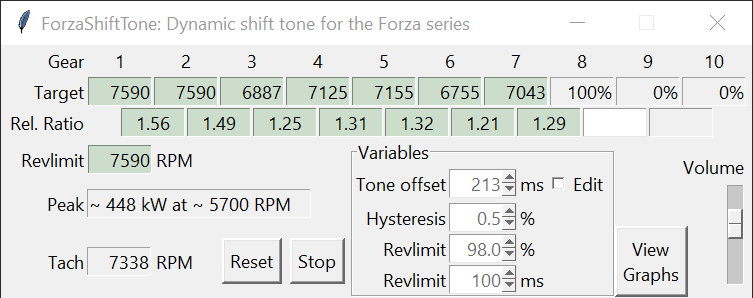
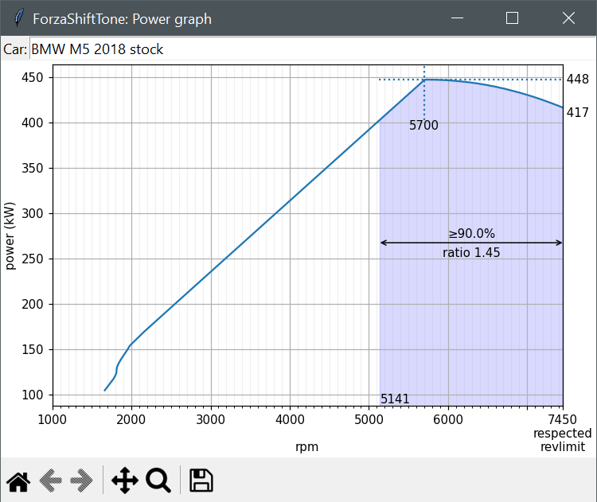

# ForzaShiftTone

**Windows GUI application to provide a shift tone in Forza Motorsport and Forza Horizon 4/5.**

## TL;DR

- Per gear: Drive around on flat tarmac until you hear a double beep
  - Maintain fixed speed if it has trouble locking the gear ratio
- On a flat straight: Hold full throttle starting from low rpm until you hear a triple beep
  - Use a gear with low/no wheelspin but able to hit revlimit before the end of the straight
  - Try again if you hit the rev limiter for several consecutive seconds with no triple beep
- Be aware that false positives exist: not every beep is an upshift.

### Enable Data Out in Forza Motorsport / Forza Horizon 4/5

To enable Data Out (remote telemetry) in Forza Motorsport 8 on Steam for this application: 
- Head to **Settings** -> **Gameplay & HUD** -> scroll down to the bottom (**HUD and Gameplay** in Forza Horizon 5)
- Set **Data Out** to _On_, enter _127.0.0.1_ as **Data out IP address** and **Data out IP port** _12350_. You may have to restart the game.
- The **Data Out Packet Format** should be set to '_Car Dash_' for Forza Motorsport
- The Microsoft Store version may require a 3rd party Loopback Utility
- It is unknown whether the Data Out functions on the consoles at all

## Current release
**ForzaShiftTone.vbs**: to launch the application (Preferred)  
**ForzaShiftTone-debug.bat**: to launch the application with an additional commandline window that shows debug information

Changes:  
- Moved from displaying absolute drivetrain ratios to relative ratios between gears
- Removed zipped PyInstaller executables; they are considered a virus to due over-zealous machine-learning detection algorithms.
- Added statistics to power graph: Peak power, power at respected revlimit, 90% power range, relative ratio for >90% power

## Implementation

The Tone Offset is dynamic. The program keeps track of the time between a shift tone and an initiated shift, and modifies the running Tone Offset if the tone is early or late.
There are three triggers:
- Shift RPM: The RPM value at which power in the current becomes lower than the power in the next gear: the ideal time to upshift. If the application predicts shift RPM is reached in the defined tone offset time, trigger a beep
- Percentage of revlimit: Uses the tone offset distance as predicted distance to current RPM hitting the listed percentage of rev limit
  - Example: A rev limit of 7500 and a value of 98.0% triggers a beep if it predicts 7350 rpm will be reached in 283 milliseconds
- Time distance to revlimit: uses the tone offset value plus the revlimit ms value as predicted distance to current RPM hitting the defined revlimit. Defaults to 100 milliseconds, which leads to a prediction distance of 383ms.

The delay between beep triggers is currently set to 0.5 seconds. This time-out is shared between the three triggers.  
If you choose to not shift and remain above the trigger rpm, the program will not beep again even if revlimit is hit.

## Settings

The settings are saved to _config.json_ on exit. This includes Tone offset, Hysteresis, Revlimit %, Revlimit ms and Volume. The power curve and gear ratios are not saved.  
Remote telemetry sends data at 60 packets per second. The offset variables (Tone offset, revlimit ms) while defined in milliseconds currently use packet counts in the backend.  
There is one packet per 16.667 milliseconds, approximately.

### Per gear:

- Target: Derived shift rpm value. This requires the ratio of the current gear and the next gear to be determined (green background)
- Rel. Ratio: The relative ratio of the gear ratios between two consecutive gears. If gear 1 has a drivetrain ratio of 15 and gear 2 has a drivetrain ratio of 11 then the relative ratio is 15/11 = 1.36 approximately.

### General configuration:

- Revlimit: The limit on engine RPM by its own power. Revlimit is derived upon finishing a full throttle sweep up to revlimit.
- Tone offset: Predicted distance between the beep trigger and the trigger rpm value. This should not be taken as reaction time and minimized. It should be regarded as the time you can consistently respond to the tone with the least amount of mental effort. Defaults to 283 ms.
- Revlimit %: The respected rev limit in percentage of actual rev limit. This is to create a buffer for transients that could cause the engine to cut out due to hitting actual rev limit. Defaults to 98.0%.
- Revlimit ms: The minimum predicted distance to actual rev limit. This is to create a buffer for fast changes in RPM that would otherwise lead to hitting actual rev limit, such as in first gear. Defaults to 100ms.
- Hysteresis: Hysteresis may be set as another layer to smooth rpm. An intermediary rpm value is updated only if the change in rpm is larger than the hysteresis value, which is then used for the shift beep tests. Defaults to 0.5% of maximum engine RPM.
- Volume: Adjusts the volume of the beep in four steps total. Each step is about half as loud as the previous, where the second loudest is the default. A value of 0 mutes only the shift beep.
- Edit tickbox: If unticked, the up and down arrows for the Tone offset, Revlimit ms/% and Hysteresis values do not function. This is to avoid accidental clicks.
- Reset button: If pressed, reset revlimit, power curve and all values for all gears. Configuration values are unchanged. If the UI is unresponsive, restart the application.
- Start/Stop button: Stops or starts the loop to collect packets. In short, if button says "Stop" it is running, if it says "Start" the program is not tracking the game's packets and will not beep.
- View graphs button: If enabled and pressed, displays a power graph in a separate window. 

## Known issues
- Application will on rare occasions crash: related to the UI library and cannot be fixed
- Due to noise in the power curve it is not always possible to derive a correct peak power value in terms of rpm. It can be off by 50 or 100 rpm.
- The application assumes at least one frame of negative power as the first frame of shifting
  - Some cars shift so fast that power never goes negative: dynamic shift tone will not function properly
